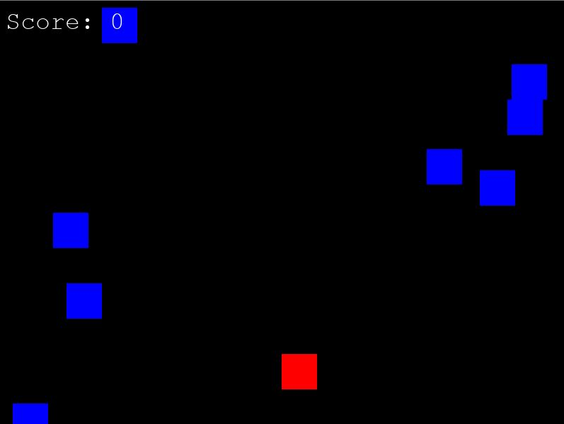

# Avoid the Falling Blocks Game

This is a simple game created using Pygame where the player must avoid falling blocks. The game involves a player-controlled square that moves left and right to dodge obstacles falling from the top of the screen. The goal is to survive as long as possible and achieve a high score.

## Features

- Player-controlled square that moves horizontally.
- Falling blocks that the player needs to avoid.
- Score tracking based on how many blocks are successfully avoided.
- Game over screen when a collision occurs.

## Requirements

- Python 3.x
- Pygame library

